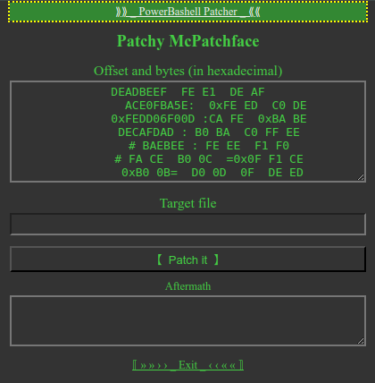

# patcher-in-browser

A bunch of patchers in various shapes:

- `patcher-in-browser` is a web-based patcher. This is for the CLIphobia who wanna patch but don't wanna touch the command prompt.
- `powerbashell` is a hybrid-app patcher. This is a polyglot shell script with a web-based user interface.
- `bash-power-patcher` is another polyglot shell script. This is for the CLI fanatics who love the text user interface.

The patches can be shared via URLs or shell commands.

## Patches format

Each line contains what to patch (hex bytes) and how to patch (offset or bytes to be searched).

Comment lines (starting with '#') are ignored. Comment should not contain `~` (tilde) since it's used for serialization of patches in URL. You can replace `~` with $HOME (in path), or %7E (in URL). 

Example of patching at specified offset with hex bytes:

       DEADBEEF  FE E1  DE AF
        ACE0FBA5E:  0xFE ED  C0 DE
      0xFEDD06F00D :CA FE  \xBA BE
      DECAFDAD : B0 BA  C0 FF EE
      # \xBAEBEE : FE EE  F1 F0

Example of searching and overwriting with hex bytes (at the offset of found bytes):

      # \xFA CE  B0 0C  =0x0F F1 CE
       0xB0 0B=  D0 0D  0F  DE ED

## Patches in URL

Patches are read from URL hash at start-up, such as `#{"name":"Patchy-McPatchface","patches":["BADBED~DE~FE~CA~7E","BE~=~DE~FE~A7~ED","#~FADEDFAD~FAE-FEE-F00"]}`

Patches are written to URL hash when the patches input lose focus.

Patches in URL can be shared easier than uploading a patch file somewhere.

## Compare file to generate patches

Expand the section "Compare file (Diff hex bytes)" to generate patches for the differences between 2 files.

## Limitations

* This tool does not support extending or truncating files
* Huge files may not be patchable (since files are loaded and patched in RAM)
* Responsiveness is reduced when there's too many text in text input (only happen with Chrome, not FireFox)

## Similar tools

Other tools that also support patches in URL:

* My fork of RomPatcher.js (patch files in URL) https://destitute-streetdwelling-guttersnipe.github.io/RomPatcher.js/#{"PATCHER":[{"name":"Boaty-McBoatface","file":"data:;base64,VVBTMQAgboMAIG6D+pUXwPqVF8AybecD"}]}
* CyberChef (search & replace hex string) https://gchq.github.io/CyberChef/#recipe=To_Hex('Colon',0)Find_/_Replace({'option':'Regex','string':'97:94:0D:00'},'79:94:0D:00',true,false,true,false)From_Hex('Auto')

## Extra: a polyglot patcher (for bash and PowerShell)

`powerbashell.ps1` can be run as a bash script or PowerShell script, but it has a web-based UI instead of textual UI (TUI).

The user interface is a web app at `http://localhost:8088/`

Patches can be shared via URL, such as `http://localhost:8088/#{"name":"Boaty-McBoatface","file":"/path/to/file","patches":["DEADBEEF~0F~F1~CE","CAFEBABE~FE~ED~FA~CE"]}`

## Extraneous Extra: another polyglot patcher for the CLI fanatics

`bash-power-patcher.ps1` is a patcher which can be run in bash and PowerShell.
Using interactive TUI, it waits for user to type in target file and patches.
It can also read user input sent via a shell pipe.

Obviously, its source code is much simpler than `powerbashell.ps1`. The LOC count is less than half the web-based patcher with the same feature set.

Patches can be shared as shell commands, such as `printf "/path/to/file \n DEADBEEF:0F F1 CE \n CA=FE" | bash-power-patcher.ps1`

